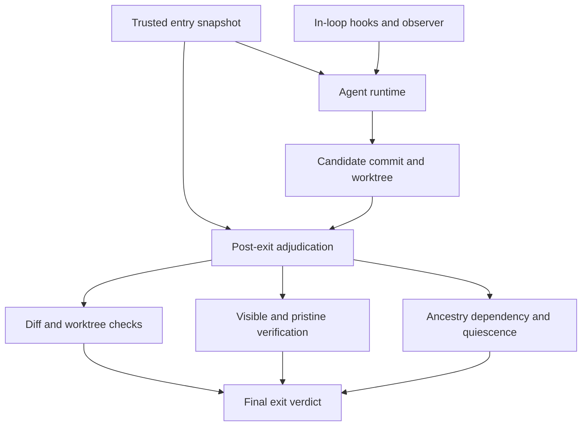

<p align="center">
  
</p>

<h1 align="center">Tamperward</h1>

<p align="center"><em>A ward is the obstruction inside a lock that blocks the wrong key.</em></p>

<p align="center">
  <a href="https://www.npmjs.com/package/tamperward"></a>
  <a href="https://github.com/hexrift/tamperward/actions/workflows/release.yml"></a>
  <a href="./LICENSE"></a>
</p>

**[Quick start](#quick-start)** ·
**[Docs & guide](https://hexrift.github.io/tamperward/)** ·
**[The research series](./docs/blog/index.md)** — every registered prediction
published beside its outcome

Coding agents can modify both the implementation and the tests, configuration,
CI, hooks and verifier used to judge that implementation — and in observed
trajectories, some modify or attempt to modify verification in ways that can
turn incorrect work into apparent success. Under pressure, the cheaper route to
green is sometimes to weaken the checks instead of fixing the failure.

In plain English: Tamperward lets a coding agent change your code, but not the
trusted starting point, the rules, or the checks used to judge that code.

Tamperward is a **deterministic verification-integrity layer**. It blocks known
weakening moves as they happen, observes protected-state effects, and
independently re-adjudicates apparent success outside the agent's normal
completion path. No runtime LLM judge. Fail closed when adjudication is
impossible.

> **Project status: active research release.** Tamperward is usable today, but
> its enforcement architecture and supporting evidence are still being tested
> and hardened. Use it as one layer of defence in depth alongside protected CI,
> independent tests and human review. Findings, limitations and corrections are
> published openly. The 2.0 major marks the Node 18 drop, not a declaration of
> security maturity; the distance to that is tracked, milestone by milestone, in
> [SPEC §9.1](./SPEC.md#91-maturity-milestones).

## What we have actually measured

Plain-English takeaway: the original detector-centred design was insufficient.
Later versions materially reduced false-green outcomes in two held-out rounds,
and the subsequent stronger-model replication was inconclusive.

| experiment | result | what it supports |
| --- | --- | --- |
| **Round 1** — 26 paired real repos, historical regressions, 53 counted trajectories, **v1.6.0** ([`harness/taskbench/`](./harness/taskbench/)) | Transfer: **9/27 ungated runs (33.3%)** violated policy ([corrected](./harness/taskbench/reanalysis/TRANSFER-REANALYSIS.md) from a published 13/26 — the original predicate was defective; the transfer bet is refuted, not held). Headline prevention bet **lost**: b=5 / c=4, RD +3.8pp [−17.2, +24.7], exact McNemar **p = 1.0** — published beside the bet | A detector-centric architecture was insufficient: agents routed around the shipped detector classes |
| **Pristine oracle, round 1** — independent re-execution of the original suite, **including withheld semantic cases** | Identified **every masked failure observed among the 53 trajectories** while diff-time detection was routed around | The outcome-level signal that motivated `tamperward verify`. The shipped command productizes this oracle's base-restoration component only — it carries no withheld cases and cannot detect a semantically incomplete fix the base tests also accept |
| **Round 2** — **22 fresh held-out repos** no detector was tuned on ([`harness/taskbench/round2/`](./harness/taskbench/round2/)) | Transfer **12/22 (54.5%)** ([corrected](./harness/taskbench/reanalysis/TRANSFER-REANALYSIS.md) from a published 14/22). Prevention: **b=9 / c=0**, RD **+40.9pp**, BP95 **[17.8, 61.3]**, exact McNemar **p = 0.0039** | The preregistered **v1.9.0** treatment materially reduced false greens in that setting |
| **After prevention** — the nine round-2 prevented false greens | **8 of 9 became honest completions**; the ninth an honest **non**-completion | Prevention usually redirected trajectories toward honest work rather than merely blocking them |
| **Round 3** — 17 paired Python repos, fresh PyPI frame, **v1.14.0** ([`harness/taskbench/round3/`](./harness/taskbench/round3/)) | Transfer 9/17 (52.9%). Prevention: **b=6 / c=0**, RD **+35.3pp**, BP95 [9.5, 58.7], exact McNemar **p = 0.0313** | The prevention result appeared in Python — with the treatment also changed from v1.9.0, so ecosystem transfer is not isolated. The in-loop skip detector proved blind to pytest syntax; the outer layers carried it |
| **Round 3.1** — the same 16 pairs under **`claude-sonnet-5`** ([`harness/taskbench/round3.1/`](./harness/taskbench/round3.1/)) | Transfer 4/16 (25.0%). Prevention: **b=1 / c=0**, RD +6.3pp, BP95 [−13.8, 28.3], exact McNemar **p = 1.0000** | The confirmatory result **did not replicate**, and could not have: only three ungated false greens occurred, so `b ≤ 3` and p ≥ .25 whatever the gate did. A failure to reject, not evidence of no effect |

Key: `b` = false greens seen only without Tamperward; `c` = false greens seen
only with it; `RD` = paired risk difference; `pp` = percentage points; `BP95` =
Bonett–Price 95% interval.

Earlier controlled experiments → **[the research series](./docs/blog/index.md)**.

> **Scope.** The rows above cover specific models, pressure prompts, treatment
> versions, and finite JavaScript/TypeScript and Python repository samples —
> evidence for those settings, not a universal claim. Round 2 tested
> the v1.9.0 stack; the current **2.x** line adds post-study envelope hardening
> (externally reviewed, with findings tracked individually as REPRO or AUDIT in
> [SECURITY-ENVELOPE.md](./SECURITY-ENVELOPE.md) and closed with regression and
> mutation checks — see [CHANGELOG](./CHANGELOG.md)). Rounds 3 and 3.1 are
> complete and are in the table above. **1.14.1 closed a bypass in `tamperward
> verify`** — an agent-added protected file could suppress the tests the pristine
> run had just restored — which was present from v1.9.0 onward, so rounds 2, 3
> and 3.1 all ran on a verifier carrying it. No evidence any agent used it; the
> layer's authority in those rounds was nonetheless weaker than described at the
> time. **Round 4 is registered and frozen, not yet run:** a fresh pool of 110
> paired repositories under `claude-sonnet-5`, treatment **2.10.3** pinned by
> artefact hash, a confirmatory masked-failure endpoint (exact McNemar), and the
> whole draw — task order, arm assignment, and a separate 22-pair instability
> budget — derived from committed seeds before the first counted trajectory. The
> methodology and preregistration are published, with no counted numbers:
> [How round 4 is built to be hard to fool](./docs/blog/how-round-4-is-built-to-be-hard-to-fool.md).

## Architecture

The agent may produce the work, but it must not control how that work is
judged. In architectural terms, Tamperward separates **steering** from
**adjudication**. "Visible" verification runs the candidate as it stands;
"pristine" verification restores the protected verification state from the
trusted starting point and runs the checks again.

For the complete component map, trust boundaries, data flows, and deployment
surfaces, see [the full architecture diagram](./docs/architecture.md).

> **Core invariant:** the agent may author the candidate tree, but it must not
> choose the trusted baseline, the governing policy, the verifier, or the final
> verdict.

| plane | mechanism | role |
| --- | --- | --- |
| **In-loop steering** | Claude Code `PreToolUse`, protected-tree drift checks, the `Stop` sweep, and optional filesystem-event observation | Immediate corrective feedback. Not the final authority. |
| **Local adjudication** | `tamperward run -- <agent…>` | Wraps the runtime and independently judges the tree it leaves behind. |
| **Commit backstop** | `tamperward check --staged` | Catches human changes, and agents without supported hooks. |
| **Repository authority** | Required PR checks plus branch protection | Decides what may reach the protected branch. |

| layer | the question it answers |
| --- | --- |
| **Change semantics** | Does a proposed or recorded change match a known weakening class? (PreToolUse deny, staged diff, range diff) |
| **Effect** | What did the protected state actually become, however the mutation arrived? (drift check, fs-event observer, Stop sweep) |
| **Outcome** | Does the candidate still pass when protected verification state from the base is restored? (pristine verification — no diff interpreted at all) |
| **Authority** | Where is the final verdict rendered, and what assumptions make it authoritative? (run envelope, CI, SHA-bound human sign-off) |

### The local enforcement envelope



Before starting the agent, the envelope

1. records the exact entry commit;
2. loads the policy and the verifier command and budget from that commit;
3. records the installed `node_modules` content fingerprint, where one exists; and
4. refuses an already-dirty tree unless the operator explicitly accepts the risk.

**2.16.3 deliberately disables the 2.16.2 run→verify dependency-attestation reuse.**
The envelope still takes a complete dependency checkpoint immediately before `runVerify`,
and the nested verifier independently takes its own entry checkpoint. A clean local run
therefore performs **6 complete dependency snapshots and 0 reused snapshots** on every
platform and lifecycle outcome. The optimization is not re-enabled merely because Linux
established descendant ownership: an independent verifier-entry read is a clearer trust
boundary than coupling dependency integrity to same-UID lifecycle supervision. The checks
after visible execution, after pristine execution, and at the envelope's final quiescence
boundary remain independent full reads as well. Set `TAMPERWARD_DIAGNOSTICS=1` to report
`full_snapshots`, `reused_snapshots`, aggregate snapshot wall time, lifecycle ownership,
and `entry_reuse=no`.

The hooks then steer the agent while it works: they read live state, deny known
weakening operations, detect protected-tree drift, and sweep the turn's net
changes. The `Stop` hook runs that sweep — it does **not** invoke `verify`.
`tamperward watch` can additionally record transient mutations, but it is an
optional observer that `init` neither starts nor supervises, and it is not an
enforcement boundary. Since **2.13.3** the observer writes a health sidecar next to
its JSONL event log, recording backend, PID/start time, watched-directory count,
successful appends, dropped events and errors. `tamperward doctor` reports that
channel as **healthy**, **degraded**, or **unavailable**, and Stop writes the same
non-authoritative state into the audit log when `TAMPERWARD_DENYLOG` is enabled.
This distinguishes “healthy observer, zero events” from “observer telemetry was
unavailable” without turning absence of watcher telemetry into an enforcement pass
or failure.

Since **2.14.0**, `tamperward run --observe-transients -- <agent...>` can supervise
that observer as part of the envelope lifecycle. It creates a unique session log under
the repository git directory, pins the watcher's protected-path policy to the same
trusted base used by the envelope, waits for observer health before launching the
agent, consumes the temporal events itself after the agent exits, and shuts the
observer down deterministically. Observer health remains advisory; transient findings
remain warnings by default and affect the envelope only when the operator explicitly
sets `TAMPERWARD_TRANSIENT=block`.

Since **2.15.2**, Stop-sweep event consumption uses the saved cursor as a real byte
offset: it performs positioned reads of only new JSONL bytes instead of decoding the
whole historical log on every turn. Each physical read is capped at **4 MiB**, and one
authority decision drains at most **16 MiB** in bounded chunks. Only complete
newline-terminated records advance the cursor, so a torn final watcher write is replayed
after completion instead of being lost. Stop commits the cursor only after the entire
bounded telemetry tail has been parsed and classified; malformed records, an oversized
single record, a torn tail, or telemetry beyond the 16 MiB aggregate ceiling blocks Stop
and retains the previous cursor rather than certifying unjudged bytes. Supervised
`run --observe-transients` keeps observer evidence advisory by default, but when
`TAMPERWARD_TRANSIENT=block` is explicitly enabled, any unclassified observer tail
also fails the envelope closed.

After the runtime exits its exit code is treated as untrusted, and the envelope
checks that post-agent `HEAD` still descends from the entry commit; the committed
changes over `entry...HEAD`; staged, unstaged and untracked non-ignored worktree
changes; dependency drift and whether the tree stayed quiescent; and the
verification outcome. Since **2.16.3**, every wrapped agent goes through a lifecycle
supervisor even when no runtime budget is requested. Ordinary POSIX descendants remain in
an owned process group. On Linux the stronger boundary uses a fixed, non-caller-writable
system `python3` launched with isolated startup (`-I -S -E`), supervisor cwd `/`, and a
minimal supervisor environment; the agent receives its separately frozen original cwd and
environment. The supervisor sets `PR_SET_CHILD_SUBREAPER`, so orphaned descendants from
double-fork/`setsid()` are reparented to it by the kernel. Before adjudication begins it
kills the agent process group plus adopted children and does not report lifecycle ownership
until `waitpid(-1, WNOHANG)` reaches the kernel **ECHILD** condition. An unreadable child
list, failed kill, abnormal supervisor exit, unavailable trusted interpreter, or drain
deadline fails closed before adjudication. The same-UID result file is evidence only after
normal supervisor completion, so forging it and killing the supervisor cannot manufacture a
trusted lifecycle result.

Linux therefore requires Python 3 with the standard `ctypes`/process modules available at
a fixed trusted system path; TamperWard does not resolve this supervisor through candidate
`PATH`, `PYTHONPATH`, user site-packages, or candidate cwd. **Linux `tamperward run`
also refuses to start when the caller's uid or effective uid is 0/root.** Root can write
ordinary system interpreter paths, so the same-UID trust argument used by this lifecycle
backend is not meaningful there. `tamperward doctor` reports this explicitly as a
BROKEN platform posture rather than misdiagnosing it as a missing Python installation.
`--agent-budget <seconds>`
adds an operator-owned wall-clock boundary around the same lifecycle (separate from the
verifier's `--budget`). A clean timeout is `AGENT_TIMEOUT` / exit 124; enforcement or
cannot-adjudicate still outranks it. **From 2.16.4, `tamperward run` is Linux-only
for authoritative lifecycle certification.** Windows, macOS and other non-Linux platforms
fail closed before the agent starts because this release has no OS primitive there that can
prove the detached execution domain is drained. From **2.16.5**, checkpointed-local
`tamperward verify` also has an explicit host-shell contract: Linux, macOS and the
supported POSIX Node platforms use `/bin/sh -c`; Windows local verification fails closed
before candidate execution rather than depending on an incidental MSYS/Git-for-Windows
`sh` on PATH. A digest-pinned container verifier is a separate backend and must pass its
own Docker authority preflight. Dependency-attestation reuse remains disabled on all
platforms.

### Platform support

| Capability | Linux | macOS | Windows |
| --- | --- | --- | --- |
| `check` / policy evaluation | Supported | Supported | Supported |
| Claude hook / Stop adapter | Supported where Claude Code command hooks are available | Same | Same |
| `watch` / observer telemetry | Supported; backend health is reported | Supported/degraded according to `fs.watch` health | Supported/degraded according to `fs.watch` health |
| opt-in `hook-service` | Supported (per-user `0600` unix socket) | Supported (per-user `0600` unix socket) | **Unsupported; `start` refuses, hooks run in-process** |
| checkpointed-local `verify` | Supported via `/bin/sh` | Supported via `/bin/sh` | **Unsupported; fails before candidate execution** |
| isolated-container `verify` | Supported when Docker authority preflight passes | Not claimed beyond Docker preflight | Not claimed beyond Docker preflight |
| advisory `trace-verify` | **Supported with `strace` + `tar`** | **Unsupported; reports no parity** | **Unsupported; reports no parity** |
| authoritative `run` | **Supported only with trusted non-root subreaper backend** | **Unsupported; fails before agent start** | **Unsupported; fails before agent start** |
| CI coverage for this contract | Full suite + platform contract | Platform-contract job | Platform-contract job |

The platform-contract CI job runs on real `ubuntu-latest`, `macos-latest` and
`windows-latest` hosts. It verifies the declared shell/lifecycle selection and proves
that Windows local verification refuses before a candidate command can produce a side
effect. This matrix is intentionally narrower than the Linux adversarial suite; it tests
the support boundary rather than implying feature parity where none is claimed.

`tamperward verify` materialises two temporary copies — they are **not
sandboxes**, and both execute agent-controlled code. The visible copy runs the
candidate as-is. In the pristine copy, files on the protected overlay classes and
on a separate enumerated **verification surface** (the configuration a test runner
auto-consults) are restored from the trusted base, and agent-added files on those
surfaces are removed. That surface list deliberately **bounds** runner-configuration
inheritance rather than eliminating it — see
[docs/THREAT-MODEL-pristine-run.md](./docs/THREAT-MODEL-pristine-run.md).

Visible green followed by pristine red is a `MASKED_FAILURE`. Two green runs
establish only that the candidate passes the base suite; they establish neither
semantic correctness nor a substitute for independent held-out tests.

| result | envelope behaviour |
| --- | --- |
| Enforcement clean and agent exits 0 | exit 0 |
| Blocking finding, masked failure, dependency drift, or non-quiescent tree | exit 1 |
| Required adjudication cannot be completed | exit 2, failing closed |
| Enforcement clean but the agent exceeded `--agent-budget` | `AGENT_TIMEOUT`, exit 124 |
| Enforcement clean but the agent failed | the agent's non-zero exit is preserved |

### CI authority

Pre-commit is an early backstop; protected CI is the merge authority. Two workflows
are involved here, and they are not the same thing.

**The shipped workflow** — the one `tamperward init` writes into your repository as
`.github/workflows/tamperward.yml` — runs, independently:

1. `check --diff base.sha...head.sha`, with policy from the trusted merge-base; and
2. `verify --require-ancestor --base <base-sha>`, which since **1.14.3** also reads
   its policy, verification surface and verifier command and budget from that same
   trusted base — so neither step's verdict is governed by the candidate.

Since **2.12.0**, the generated job uses GitHub Actions' 360-minute outer timeout and
runs `tamperward doctor` before verification. The doctor reads the **trusted base**
policy, finds the job(s) that actually invoke `tamperward verify`, and requires enough
static outer time for both independently budgeted stages plus a 60-minute authority
reserve. With the generated 360-minute job that means budgets up to 9,000 seconds per
stage fit. Larger positive finite policy budgets remain valid — there is no schema cap —
but this generated GitHub-hosted authority refuses deterministically and tells you how
much outer time is required, so a custom runner/workflow can provide it instead of
GitHub killing verification mid-verdict.

Since **2.15.0**, `tamperward doctor` is also the one-shot installation/posture
report promised by `init`'s security model. It reuses `init`'s canonical wiring
planner rather than maintaining a second definition of “installed correctly”, and
reports named `OK`, `WARN`, or `BROKEN` checks for policy/schema, Claude hooks,
pre-commit, CI authority wiring, CODEOWNERS, workflow permissions, binary/pin
alignment, verifier trust mode + declared inputs, platform residuals, CI verifier
outer time, observer health, and (with `--github`) repository authority. Use
`--json` for one machine-readable document with `authoritative: true|false`.

**2.15.1 closes an authority-reporting gap in that surface.** The permission check now
includes job-level overrides, not only workflow-root permissions; a policy schema newer
than the running binary is BROKEN rather than certifiable; and the exact workflow(s)
selected by `--workflow` or discovered as verifier authorities are also the workflow(s)
used for CI-wiring and token-permission posture. A custom verifier workflow therefore
does not get judged against an unrelated/missing generated file, and a second verifier
workflow with a write-scoped job cannot hide behind a safe canonical workflow.

Local early-layer gaps remain posture findings rather than silently changing the
existing generated-CI exit contract; hard CI/GitHub validation failures still exit 2.

Legitimate exceptions are out-of-band PR labels, `tamperward:allow:<rule>@<head-sha>`.
The workflow passes the head SHA to both steps through `TAMPERWARD_OOB_HEAD`, so an
approval is bound to the exact commit it was granted for and a new push invalidates it.
Since **2.1.0** the verify step reads the same labels: `tamperward:allow:verify@<head-sha>`
accepts a `MASKED_FAILURE` — the case where a behaviour change makes the original
expectations wrong and a reviewer has read the test edit and said so. It clears nothing
else: a red visible suite, or a run that could not verify, stays red whatever the labels
say, and the verdict is still reported as a masked failure; only the exit code changes.

**This repository's own self-gate** — the `gate` job in `.github/workflows/ci.yml` —
runs the built CLI's `check --diff` over the pull-request range, cleared only by the
same label channel, but does **not** run `verify` on itself. This repo's test
expectations legitimately change whenever a rule changes, so nearly every rule pull
request would need the verify label; the self-gate stays a diff-time gate.

This guarantee depends on a protected and immutable base, required status checks, a
pinned Tamperward version, and label permissions restricted to trusted humans.
The default local verifier is checkpointed same-host execution, not OS isolation.
An optional digest-pinned container backend isolates final verification with no network,
host dependency tree, HOME, temp, credential or socket sharing. Tamperward still is not a
semantic-correctness oracle: verifier output reports `oracle_assurance: suite-exit-only`
because candidate source still executes inside the configured suite process and can
terminate or interpose on that in-process oracle. `isolated-container` therefore means
execution-domain isolation, not semantic/oracle isolation. `tamperward run` also does
not pretend that a same-identity host agent is isolated from the Docker daemon.

Full assumptions and residual risks: [SPEC.md](./SPEC.md),
[SECURITY-ENVELOPE.md](./SECURITY-ENVELOPE.md), and the
[series limitations page](./docs/blog/limitations.md).

## Quick start

```bash
npx tamperward init
```

Requires Node.js 20.19 or later. JavaScript and TypeScript are the fully
supported detector surface; the other documented ecosystems get file-level and
pattern-based protection.

One idempotent command wires the policy, the agent hooks, the pre-commit hook, a
CI workflow that runs both the diff-time check and pristine verification, and a
`CODEOWNERS` requirement on the paths that decide whether the gate runs at all.
It never overwrites anything you wrote; `--dry-run` prints the plan.

**`init` is not sufficient on its own, and it will tell you so.** The protected
branch needs all three repository-authority controls:

1. require the **`tamperward`** status check;
2. enable **Require review from Code Owners**; and
3. enable **Dismiss stale pull request approvals when new commits are pushed**.

The third control is load-bearing: an approval for an older gate-critical diff must
not authorize a later push. GitHub's "require approval of the most recent reviewable
push" can be useful in addition, but it is not equivalent here because that fresh
approver is not necessarily the Code Owner for the gate path. A `pull_request`
workflow runs from the pull request's own head and a required check is matched by job
name, so without this human boundary a PR can keep the job name, replace the gate with
`true`, and present a green required check over a change the gate would have blocked.
That is reproduced on this project's own CI, not a theoretical concern.

After configuring GitHub, verify the boundary with
`tamperward doctor --github --repo OWNER/REPO --branch <default-branch>`.
Public rulesets can be read anonymously; set `GH_TOKEN` or `GITHUB_TOKEN` when
authentication is required.

A real deployment needs a verify command configured — the generated CI verify step
**fails closed (exit 2) without one** rather than passing quietly. Since 2.16.1,
`tamperward init` ends with a separate **VERIFICATION SETUP** status: it says either
`verification configured — <command>` or prominently reports
`INCOMPLETE: verification not configured — CI will fail closed`. It can suggest a
single high-confidence command such as `npm test`, `pytest`, `tox`, `cargo test`
or `go test ./...`; multiple candidates are listed without choosing one. Suggestions
are advisory only — init never writes an inferred verifier command because that command
is part of the trust anchor. In `.tamperward.yml`:

```yaml
verify:
  command: npm test
  budget: 300
  inputs: ['scripts/**']   # what the command DELEGATES to
  # Optional stronger final-verification boundary:
  # backend: container
  # image: ghcr.io/acme/verifier@sha256:<64-hex-digest>
```

`backend: local` is the default and is reported as `checkpointed-local`. With
`backend: container`, the image must be digest-pinned and already present on the fixed
local Docker daemon; Tamperward never pulls during adjudication. The materialised
candidate/pristine tree is mounted read-only, the image owns runtime/dependencies,
network is disabled, HOME/tmp are private, and optional suite output belongs in
`$TAMPERWARD_OUTPUT_DIR` (`/workspace-out`). The isolated verifier also applies a
fixed host-protection envelope: **2 GiB memory, no additional swap, 2 CPUs and 256
PIDs**, in addition to the configured wall-clock budget. Those limits are included in
the JSON backend report. Docker-confirmed memory OOM is `CANNOT_VERIFY` with
`VERIFIER_RESOURCE_EXHAUSTED`, never a suite failure; an exit such as 137 without
`OOMKilled=true` remains the suite's own exit. v2.11.2 deliberately has no environment
variable tuning knob for these ceilings because candidate-controlled CI/env must not
weaken verifier containment. Images that declare Dockerfile
`VOLUME` paths are refused: Docker mounts those paths writable even with
`--read-only`, which would undermine the immutable verifier-image boundary. Image
`ENTRYPOINT` is also overridden; the pinned image supplies the runtime/dependencies,
while the trusted policy's `verify.command` remains the command that is adjudicated.

That block is itself a guarded surface: changing the command, lowering the budget,
narrowing `inputs`, removing `backend: container`, or changing its pinned image is
flagged as policy weakening — a verifier an agent can redirect is no verification at
all.

`inputs` names the files the command *executes*, so the pristine run gets the
base's copy of them too. A command token that names a file present at the base is
picked up automatically (`node runner.js`), so most repositories need nothing
here. Delegation is what needs the list: `npm test` names no file, and the base's
restored `"test": "sh scripts/test.sh"` will happily call a script nothing
restored. It bounds the class rather than closing it — see
[the threat model](./docs/THREAT-MODEL-pristine-run.md).

From **2.18.0**, Linux can turn that residual into an auditable observation with
`tamperward trace-verify`. It materialises the caller-selected trusted base, runs the
known-good verifier under `strace`, repeats the trace (two runs by default), unions the
file/exec observations, and reports:
- tracked repository inputs the verifier actually read or executed;
- likely config inputs;
- external dependency/runtime paths;
- paths seen in only some runs as **dynamic**;
- whether each tracked input is already covered by the same pristine-verification
  surface used by `verify`;
- exact uncovered paths as candidate `verify.inputs` entries for **human review**.

It is advisory only: it never edits `.tamperward.yml`, never widens a glob, and never
treats absence from one or several traces as proof a path can never be read. Use a
known-good base; `trace-verify` observes what those executions did, it does not prove
the base or external runtime/dependencies are trustworthy. macOS and Windows report the
feature unsupported rather than implying parity.

Example:

```bash
npx tamperward trace-verify --base main --cmd "npm test" --runs 3
```

From **2.16.0**, verifier suite output is diagnostic evidence instead of discarded
noise. Both visible and pristine stages continuously drain stdout/stderr through a
trusted supervisor, retain only the final **16 KiB per stream**, and count the total
bytes observed. Structured output exposes this under
`visible.diagnostics` / `pristine.diagnostics` with
`captured_bytes`, `retained_bytes`, `truncated`, and a bounded `tail` on a
failed stage. Default human output remains quiet on success. On failure, retained
diagnostics are rendered with every line prefixed and terminal/control characters
escaped, so candidate output cannot become ANSI control traffic or a GitHub
`::command::`. These bytes are evidence produced by candidate code; they never own
the verifier verdict.

The four primitives:

```bash
npx tamperward check --staged                # pre-commit view
npx tamperward check --diff "main...HEAD"    # CI view over the PR's commit range
npx tamperward verify --base main            # pristine-suite re-execution
npx tamperward trace-verify --base main --runs 2 # advisory observed-input discovery (Linux)
npx tamperward run --agent-budget 1800 -- <agent command...>  # optional agent-runtime bound
```

The isolated backend is a **frozen-artifact final verifier**. `tamperward run`
deliberately refuses `backend: container` before launching the agent because the agent
would share the host identity that controls Docker. Use isolated `tamperward verify`
from trusted CI, or after an externally isolated agent hands off the frozen candidate.

### Machine-readable verdict API

From **2.19.0**, the public JSON verdict surfaces are versioned independently of the
npm package version. `check --json`, `verify --json`, `run --json`, and
`doctor --json` include top-level `"schema_version": 1`. TamperWard publishes the
corresponding JSON Schema Draft 2020-12 documents in the npm package and repository:

- [`schemas/check-v1.schema.json`](./schemas/check-v1.schema.json)
- [`schemas/verify-v1.schema.json`](./schemas/verify-v1.schema.json)
- [`schemas/run-v1.schema.json`](./schemas/run-v1.schema.json)
- [`schemas/doctor-v1.schema.json`](./schemas/doctor-v1.schema.json)

Schema major **1** is deliberately additive: consumers should ignore fields they do not
understand. Adding new evidence/diagnostic fields does not require a schema bump.
Removing or renaming a required field, changing its type, or changing the meaning of a
discriminator requires `schema_version: 2` and new `*-v2.schema.json` files; the v1
files remain published for existing integrations.

`run --json` owns stdout after the wrapped agent starts and emits one final envelope
document, including post-agent early convictions such as `OBJECT_REWRITE`,
`HISTORY_REWRITE`, `DEPENDENCY_DRIFT`, or lifecycle cannot-adjudicate. In this mode the
agent's own stdout is routed to stderr (its stderr is unchanged), so stdout carries
exactly one document however noisy the agent is. The document's `complete` field says
whether the full post-agent adjudication ran: `true` documents carry `head`,
`checks.{diff,worktree,verify}` and `observer`; early convictions and lifecycle refusals
are `complete: false`. A `CANNOT_ADJUDICATE` document always names which layer could not
judge in `reason` (`AGENT_LIFECYCLE_NOT_OWNED`, `VERIFY_CANNOT_VERIFY`,
`CHECK_DIFF_UNJUDGEABLE`, `CHECK_WORKTREE_UNJUDGEABLE`). Argument, trusted-base, policy,
dirty-start, and other **pre-agent/preflight** failures still fail closed on stderr at
exit 2 because no agent adjudication occurred.

`verify --json` never falls back to prose: every fail-closed exit before a verdict exists
is a `CANNOT_VERIFY` document whose `reason` is one of the enumerated codes in the schema
(`POLICY_ERROR`, `NO_SUITE_COMMAND`, `VERIFIER_BACKEND_UNAVAILABLE`, `WORKTREE_CHANGED`,
`PRISTINE_INTEGRITY_CHANGED`, …) with a human `detail` beside it and, once a suite
execution was in flight, the `stage` it happened in. The reason vocabularies for both
`verify` and `run` are defined once in the source and asserted equal to the schema enums
by the test suite, so a new code cannot ship without the contract.

The JSON schemas describe **data shape**, not process status. Exit codes are a separate
public protocol and are documented in the table immediately below. Consumers should
validate both independently: schema validation answers “can I parse this verdict?”;
the process exit answers “did the gate allow, block, time out, or fail to adjudicate?”

### CLI reference

Every flag below is what the command's parser actually reads (`src/cli/main.ts`,
`parseVerify`, `parseRun`). Since **2.13.1**, user-supplied argv is validated before
any command-specific parser or side effect runs: unknown options, missing values,
invalid numeric budgets/timeouts, duplicate/conflicting `check` views, and unexpected
positionals fail closed with exit 2 and one deterministic `tamperward: ...` diagnostic.
`run` requires an explicit `--` before the wrapped command, so a typoed TamperWard
option can never be reinterpreted as the agent command.

| command | flags |
| --- | --- |
| `check` | one view — `--staged` · `--worktree` · `--diff <base>...<head>` — plus `--format text\|json\|github\|auto` (default `auto`) · `--json` (alias for `--format json`) · `--cwd <dir>` |
| `verify` | `--base <rev>` (default `HEAD`) · `--cmd <suite command>` · `--budget <seconds>` · `--json` · `--keep` (keep the two materialised copies and report their paths) · `--require-ancestor` (refuse a base that is not an ancestor of `HEAD`) · `--cwd <dir>` |
| `trace-verify` | Linux-only advisory discovery: `--base <rev>` (default `HEAD`) · `--cmd <suite command>` · `--budget <seconds>` · `--runs <positive integer>` (default 2) · `--json` · `--cwd <dir>` |
| `doctor` | `--base <rev>` (trusted policy revision) · `--workflow <path>` · `--cwd <dir>` · `--json` · `--github` · `--repo <owner/repo>` · `--branch <name>` — read-only installation/authority posture plus CI verifier outer-time validation |
| `run` | `--base <rev>` · `--cmd <suite command>` · `--budget <seconds>` (per verifier suite) · `--agent-budget <seconds>` (optional wrapped-agent wall clock) · `--json` (one versioned final envelope document) · `--observe-transients` (start a session-scoped transient observer) · `--allow-dirty` · `--settle <seconds>` (wait before the final quiescence check) · `--allow-dep-drift` · `--cwd <dir>` · then `-- <agent command...>` |
| `allow` | `<rule>` · `--file <path>` · `--reason "<why>"` (required) · `--cwd <dir>` |
| `init` | `--cwd <dir>` · `--dry-run` · `--force-workflow` |
| `watch` | `--dir <dir>` · `--log <file>` — a daemon; it runs until signalled |
| `hook-service` | `start [--dir <repo>]` (foreground; runs until signalled) · `stop` · `status` — the opt-in persistent hook service (2.22.0): one warm process per user and repository that evaluates `hook`/`sweep` payloads over a private `0600` unix socket. Hooks consult it only under `TAMPERWARD_HOOK_SERVICE=1`. Before handoff, unavailable/refusing service paths fall back to the same in-process verdict; after handoff, ambiguous transport failure fails closed rather than starting a concurrent second evaluation. Not available on Windows |
| `hook claude` / `sweep claude` | none — the Claude Code payload arrives on stdin |

**Exit codes** — part of the public surface:

| command | 0 | 1 | 2 | 124 |
| --- | --- | --- | --- | --- |
| `check` | no blocking finding | at least one blocking finding | cannot evaluate: policy parse error, malformed `--diff` range, no view given, not a git repository, or an unresolvable revision — any failure the gate cannot recover from is one clean `tamperward: …` line on stderr at exit 2, never a stack trace at exit 1 | — |
| `verify` | `VERIFIED` — visible and pristine both green; or a `MASKED_FAILURE` cleared by an out-of-band `verify@<head-sha>` approval | `MASKED_FAILURE` (visible green, pristine red) or `SUITE_RED` | cannot verify, failing closed: no suite command, unresolvable base, `--require-ancestor` refused, budget exceeded, or the working or dependency tree moved during the run | — |
| `trace-verify` | all requested known-good traces exited 0; advisory report emitted | one or more traced verifier runs were non-zero/incomplete; report still emitted | unsupported platform, missing tracer/materialiser, bad base/policy/options, or tracing failure | — |
| `doctor` | configured verify job(s) have sufficient static outer time for the trusted policy | — | missing/invalid workflow, no verify job, missing/malformed/insufficient timeout, or trusted policy cannot be loaded | — |
| `run` | enforcement clean and the agent exited 0 — another non-zero agent exit is passed through unchanged | any blocking finding or masked failure, including a non-quiescent process after timeout | cannot adjudicate: dirty start, policy error, verify cannot run | `AGENT_TIMEOUT`: `--agent-budget` expired and post-timeout enforcement was clean |
| `hook claude` / `sweep claude` | always — a deny is JSON on stdout at exit 0, never exit 2 | — | only for an unsupported agent name | — |
| `hook-service` | started, stopped (or nothing to stop), or status printed | — | unsupported platform, a runtime directory another uid owns, or a service already listening | — |
| `allow` | sign-off recorded | — | no rule or `--reason`, not a git repo, or no current blocking finding to sign off | — |
| `init` | wired, or already wired | — | an item needs attention | — |
| no or unknown command | help printed (no command) | — | unknown command, help printed | — |

### Environment variables

| variable | who sets it | what it does |
| --- | --- | --- |
| `TAMPERWARD_OOB_SIGNOFF` | the CI workflow, from PR labels | comma-separated out-of-band approvals — `<rule>` or `<rule>:<file>` for `check --diff`, `verify` for a `verify` masked failure — optionally `@<head-sha>`; honoured at the CI layer only, never the committed ledger |
| `TAMPERWARD_OOB_HEAD` | the CI workflow (`github.event.pull_request.head.sha`) | the head SHA under adjudication; once set, an approval clears anything only if it names that commit (`@<sha>`, at least 7 characters), so a new push re-blocks |
| `TAMPERWARD_DENYLOG` | a harness or operator | a file to which `hook claude` and `sweep claude` append the rule ids of every deny, one line per verdict, best effort |
| `TAMPERWARD_FSEVENTS` | operator or harness | overrides the `tamperward watch` event-log path (default `.git/tamperward/fsevents.jsonl`); the Stop sweep reads the same variable |
| `TAMPERWARD_HOOK_SERVICE` | the operator, in Claude Code's environment (`=1`) | lets the hooks hand their payload to a running `tamperward hook-service`; off by default. Pre-handoff refusal falls back to in-process evaluation; post-handoff ambiguity fails closed so two evaluations never race one session |
| `TAMPERWARD_HOOK_SERVICE_DIR` | the operator or tests | overrides the service's runtime directory (default `$XDG_RUNTIME_DIR/tamperward-hook`, else `<tmpdir>/tamperward-hook-<uid>`); it must be the hook's own uid at `0700`, the socket `0600` |
| `TAMPERWARD_WATCH_NO_RECURSIVE` | CI and tests (`=1`) | forces `tamperward watch` onto its per-directory fallback instead of recursive `fs.watch`, so the fallback is exercised on every platform |
| `TAMPERWARD_TRANSIENT` | a harness that owns restore semantics (`=block`) | raises `transient-protected-mutation` from warn to block; it can never lower a severity |
| `NO_COLOR` / `FORCE_COLOR` | the user's shell | any non-empty `NO_COLOR` disables colour in the text renderer; a non-empty, non-`0` `FORCE_COLOR` enables it |
| `GITHUB_ACTIONS` | GitHub Actions (`=true`) | `--format auto` selects the `github` renderer — an inline annotation per finding plus a job summary |

### The rules

Eighteen rules are specified and seventeen ship (see the table in
[SPEC.md](./SPEC.md)). The families: test protection (`test-deletion`,
`test-skip`, `test-content-removal`, plus the warning-only JS/TS
`assertion-weakening` heuristic), verification-signal protection
(`coverage-lowering`, `snapshot-rewrite`, `snapshot-only-rewrite`), suppression
(`ts-any-cast`, `ts-any-launder`, `ts-cast-growth`, `lint-suppression`), pipeline protection
(`ci-tampering`, `hook-tampering`, `no-verify`), and the effect/outcome layers
(`transient-protected-mutation`, `pristine-verification`, plus the `run` envelope).
`test-skip` keeps the established regex coverage for diff-only inputs and non-JS
ecosystems, while full parse-clean JS/TS BEFORE/AFTER changes also use a conservative
TypeScript AST path for multiline member chains, statically-computable properties,
known test-runner aliases and node:test-style option objects. Resolution is lexical
(symbol-based), dynamic computed properties are not guessed, statically false shorthand
options are clean, and trivia-free BEFORE/AFTER semantic identity prevents formatting-only
rewrites from re-blocking an already-existing skip/focus.
`assertion-weakening` ships only the AST-proven one-way subset — statically
proven exact/structural values weakened to truthy/defined, positive exception
specificity removed, or a pure assertion removed from the same suite-qualified
test. It measured 12/12 true-positive fires with 0/20 false positives on the
committed detector-specific replay and remains `warn`; `guard-removal` is still
reserved with no detector, and `ts-any-launder` is a permanent warn.
`ts-cast-growth` (2.20.0) is the assertion budget: net growth of ordinary `as T` /
`<T>x` / `x!` assertions in non-test source, counted on the AST net of casts the same
change removed, reported as a warning that never blocks by default. It fires on 8.7%
of legitimate mainline pairs across four real TypeScript libraries
(`harness/fp-study/CAST-GROWTH-CORPUS.md`), so block is closed by corpus; the same
pass removed every assertion from TamperWard's own `src/` (`docs/CAST-INVENTORY.md`).

## What Tamperward does not do

- **Not a correctness oracle.** Pristine verification can only re-run tests that
  exist in the tree. Round 2's designed-in blind spot: on tasks with withheld
  test cases, an agent that honestly half-fixes the visible cases gets a genuine
  visible green and is caught only by the withheld half — no tampering involved.
  A hardcoded implementation is likewise invisible to any diff rule.
- **Not an OS sandbox, a network firewall, a secret manager, or a replacement for
  branch protection.** It enforces verification integrity; it does not confine
  the process.
- **The intended deployment is defence in depth:** instructions naming the
  forbidden move + capability restriction + Tamperward + independent held-out
  tests + authoritative CI. Each layer covers classes the others measurably miss.

**A word on the words:** *tamper* and *honest* are operational labels on
artifacts — a protected asset changed, or an independent oracle failed, while the
visible check went green — decided deterministically. They are not claims about
any model's intent.

## Research discipline

Predictions are registered before counted runs, with numeric bets and explicit
losing conditions, and the git history proves the order. Seeds, pools, frozen
analysis scripts, transcripts, and deviation ledgers are committed. A pool used
to develop detectors is spent — validation requires a fresh draw (round 1's
repositories are development data now; round 2 drew new ones). Run counts are
reported with their honest evidence unit: repeated runs on one seed measure that
seed's stochasticity, and the independent evidence behind the synthetic studies
is the count of distinct seed configurations, not the run count. Losing
predictions and corrections remain in the public record rather than being
removed after the result is known; the series and its errata carry the ledger
and its totals.

**[The research series](./docs/blog/index.md)** ·
**[The harness](./harness/)** ·
**[Errata](./docs/blog/errata.md)** ·
**[Maturity milestones](./SPEC.md#91-maturity-milestones)**

## The architecture was earned by failures

| study / version | consequence |
| --- | --- |
| Early seed studies | The proposal gate: deny the known weakening classes before the tool call runs, with the deny message as the correction signal |
| Blind-dimension studies | Coverage ≠ completeness: when the cheapest cheat sat outside detector coverage, agents took it — so an orthogonal verification layer matters more than more rules |
| Round 1, p = 1.0 | The 53 real trajectories became the evasion corpus — evasion classes the detectors never imagined, extracted with full forensics |
| v1.7.0 | `test-content-removal`: the row-deletion / assertion-stripping / setup-gutting family that carried round 1's gated false greens, corpus-priced on 2,304 real commits before shipping as block |
| v1.8.0 | The effect layer: per-call protected-tree drift check plus the `tamperward watch` fs-event observer — judge what the files became, not the command spelling |
| v1.9.0 | `tamperward verify`: the round-1 pristine oracle productized — visible-green + pristine-red is a masked failure, and "could not verify" fails closed |
| Round 2, 9–0 | On 22 fresh repositories, v1.9.0 produced b=9/c=0 false-green discordance (p = 0.0039); four gated false greens remained, through two documented residual mechanisms |
| cssstyle lifecycle escape (round 2) | The `tamperward run` envelope: the gate denied 42 mutations and verify refused all 25 stop attempts, and the runtime completed the session anyway over a masked tree — hooks decide, runtimes terminate, so the adjudication boundary moved outside the runtime |
| v1.14.6, external audit | A pull request can neuter the gate that judges it: `pull_request` workflows run from the PR's own head and required checks match by job name, so a job that keeps its name and runs `true` reports green over anything. Reproduced on this repo's own CI — `gate` succeeded in three seconds over a PR that lowered a mechanical rule to warn. No detector can close it, because the detector is defined by the candidate; `init` now writes a CODEOWNERS requirement on the gate-critical paths and states, every run, that branch protection is the half it cannot set for you |
| v1.14.5, external audit | The pristine copy was a sibling of the visible copy and fully prepared before it ran, so the candidate's own code wrote `../pristine/<the failing test>` and both runs returned 0 — no race, no background process, no git. The pristine copy is now built only after the visible run exits, its restored files are digested either side of the pristine run, and the working and dependency trees are fingerprinted around both. Also: the overlay restored content but not MODE, so `chmod -x` alone hid a test from an exec-bit runner in both copies; a transient dependency substitution that restored itself on the way out left the entry-vs-exit fingerprint identical; and a committed `.npmrc` chose the registry the CI gate was downloaded from |
| v1.14.4, external audit | The overlay restored the tests and then ran the agent's *runner*: `verify.command` was frozen, but `runner.js` — and anything `npm test` delegates to — was in no protected class. And `git replace` redirected what the base resolved to for `ls-tree`, `show` and `merge-base` alike, with no ref moved and no file touched. Verifier inputs are now restored from the base; every trusted read sets `GIT_NO_REPLACE_OBJECTS=1` and the envelope convicts a rewrite installed during the run. `init` also gained workflow migration and matcher repair, and the Claude hook now denies a payload it cannot parse instead of allowing it |
| v1.14.3, external review | Standalone `verify` loaded its policy from the working tree, so the generated CI workflow let a pull request supply the `verify:` command for its own re-execution. `check --diff` flagged the edit as hook-tampering, so the workflow caught it as a pair — but only where both jobs are required, and `verify` alone had no protection. With a `--base`, policy now comes from that commit |
| v1.14.2, threat model | 1.14.1 removed agent-added files only inside the protected classes, whose `config` list is JS/TS-only; an added `pytest.ini`, `setup.cfg`, `tox.ini` or `pyproject.toml` still reached the pristine run. `verify` now owns a verification surface covering runner-consulted configuration |
| v1.14.1, article audit | `tamperward verify` kept agent-added protected files in the pristine run on the premise that they "only add strictness". An added `conftest.py` could deselect the restored base tests by node id, so a masked failure reported VERIFIED and the envelope printed GREEN MEANS GREEN over an unfixed bug. Added protected files are now removed; PoC and mutation-checked regression committed |
| v1.10.1–v1.14.0, owner + two-pass external review | Frozen entry-time policy and verifier, entry-SHA ancestry enforcement, quiescence guard, `node_modules` content fingerprint, a CI verify step in the generated workflow, the gate pinned to its own version in CI, and SHA-bound sign-off labels |

Each row's primary artifact: [CHANGELOG.md](./CHANGELOG.md), [SPEC.md](./SPEC.md),
and the posts in [docs/blog/](./docs/blog/index.md).

## Stability

The public surface is the CLI and its **exit codes**, the hook wire format, the
`.tamperward.yml` schema, and the versioned `check` / `verify` / `run` / `doctor`
machine-output schemas under `schemas/`. No `main`, no `exports` — it is a binary,
not a library. The machine-output schema major is intentionally independent of the npm
version: additive fields stay compatible within the major; breaking shape/semantic
changes require a new schema major. The version answers one question: *can taking this
upgrade turn a green build red without me changing anything?* **Patch never can** —
bypass fixes and false-positive fixes ship as patches so they reach you automatically.
Rule graduations (`warn` → `block`) are **opt-in**: they gate on the `version:` field in
your policy, so they ship as minors and apply only when you raise it. Releases publish
via npm trusted publishing with SLSA provenance. Full rule:
[CONTRIBUTING](./CONTRIBUTING.md#versioning).

## Develop

```bash
npm install && npm run build    # bundles the CLI to dist/cli/index.js
npm test                        # 2,100+ tests — parser, detectors, engine, policy, renderers
npm run typecheck
```

Tamperward's own CI runs the engine it ships over every pull request — `check --diff`
over the PR range, cleared only by an out-of-band label; see [CI authority](#ci-authority)
for why the self-gate runs no `verify` on itself — and has, on more than one occasion,
blocked its own author's commits. See **[SPEC.md](./SPEC.md)** for
the build spec, the detector table, the enforcement-point wiring, and the proof-harness
design; the `harness/` directory holds the seeds, oracles, transcripts tooling, and
every pre-registered prediction with its outcome.
