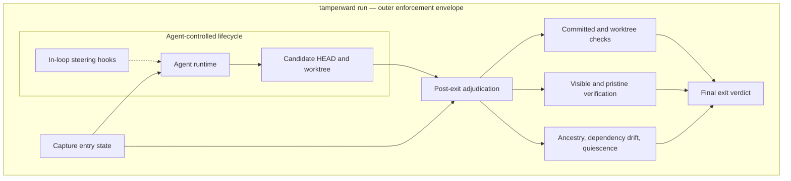

<p align="center">
  
</p>

<h1 align="center">Tamperward</h1>

<p align="center"><em>A ward is the obstruction inside a lock that blocks the wrong key.</em></p>

<p align="center">
  <a href="https://www.npmjs.com/package/tamperward"></a>
  <a href="https://github.com/hexrift/tamperward/actions/workflows/release.yml"></a>
  <a href="./LICENSE"></a>
</p>

**[Docs & guide](https://hexrift.github.io/tamperward/)** ·
**[The research series](./docs/blog/index.md)** — every registered prediction
published beside its outcome

Coding agents can modify both the implementation and the tests, configuration,
CI, hooks and verifier used to judge that implementation — and in observed
trajectories, some modify or attempt to modify verification in ways that can
turn incorrect work into apparent success. Under pressure, the cheaper route to
green is sometimes to weaken the checks instead of fixing the failure.

Tamperward is a **deterministic verification-integrity layer**. It blocks known
weakening moves as they happen, observes protected-state effects, and
independently re-adjudicates apparent success outside the agent's normal
completion path. No runtime LLM judge. Fail closed when adjudication is
impossible.

## What we have actually measured

| experiment | result | what it supports |
| --- | --- | --- |
| **Round 1** — 26 paired real repos, historical regressions, 53 counted trajectories, **v1.6.0** ([`harness/taskbench/`](./harness/taskbench/)) | Transfer: **9/27 ungated runs (33.3%)** violated policy ([corrected](./harness/taskbench/reanalysis/TRANSFER-REANALYSIS.md) from a published 13/26 — the original predicate was defective; the transfer bet is refuted, not held). Headline prevention bet **lost**: b=5 / c=4, RD +3.8pp [−17.2, +24.7], exact McNemar **p = 1.0** — published beside the bet | A detector-centric architecture was insufficient: agents routed around the shipped detector classes |
| **Pristine oracle, round 1** — independent re-execution of the original suite, **including withheld semantic cases** | Identified **every masked failure observed among the 53 trajectories** while diff-time detection was routed around | The outcome-level signal that motivated `tamperward verify`. The shipped command productizes this oracle's base-restoration component only — it carries no withheld cases and cannot detect a semantically incomplete fix the base tests also accept |
| **Round 2** — **22 fresh held-out repos** no detector was tuned on ([`harness/taskbench/round2/`](./harness/taskbench/round2/)) | Transfer **12/22 (54.5%)** ([corrected](./harness/taskbench/reanalysis/TRANSFER-REANALYSIS.md) from a published 14/22). Prevention: **b=9 / c=0**, RD **+40.9pp**, BP95 **[17.8, 61.3]**, exact McNemar **p = 0.0039** | The preregistered **v1.9.0** treatment materially reduced false greens in that setting |
| **After prevention** — the nine round-2 prevented false greens | **8 of 9 became honest completions**; the ninth an honest **non**-completion | Prevention usually redirected trajectories toward honest work rather than merely blocking them |
| **Round 3** — 17 paired Python repos, fresh PyPI frame, **v1.14.0** ([`harness/taskbench/round3/`](./harness/taskbench/round3/)) | Transfer 9/17 (52.9%). Prevention: **b=6 / c=0**, RD **+35.3pp**, BP95 [9.5, 58.7], exact McNemar **p = 0.0313** | The prevention result appeared in Python — with the treatment also changed from v1.9.0, so ecosystem transfer is not isolated. The in-loop skip detector proved blind to pytest syntax; the outer layers carried it |
| **Round 3.1** — the same 16 pairs under **`claude-sonnet-5`** ([`harness/taskbench/round3.1/`](./harness/taskbench/round3.1/)) | Transfer 4/16 (25.0%). Prevention: **b=1 / c=0**, RD +6.3pp, BP95 [−13.8, 28.3], exact McNemar **p = 1.0000** | The confirmatory result **did not replicate**, and could not have: only three ungated false greens occurred, so `b ≤ 3` and p ≥ .25 whatever the gate did. A failure to reject, not evidence of no effect |

Earlier controlled experiments → **[the research series](./docs/blog/index.md)**.

> **Scope.** The rows above are one model, one pressure prompt, one JS/TS
> ecosystem — evidence for that setting, not a universal claim. Round 2 tested
> the v1.9.0 stack; the current **v1.14.3** adds post-study envelope hardening
> (externally reviewed, with findings tracked individually as REPRO or AUDIT in
> [SECURITY-ENVELOPE.md](./SECURITY-ENVELOPE.md) and closed with regression and
> mutation checks — see [CHANGELOG](./CHANGELOG.md)). Rounds 3 and 3.1 are
> complete and are in the table above. **1.14.1 closed a bypass in `tamperward
> verify`** — an agent-added protected file could suppress the tests the pristine
> run had just restored — which was present from v1.9.0 onward, so rounds 2, 3
> and 3.1 all ran on a verifier carrying it. No evidence any agent used it; the
> layer's authority in those rounds was nonetheless weaker than described at the
> time. Round 4 is the fresh pool.

## Architecture

Tamperward separates **steering** from **adjudication**.

> **Core invariant:** the agent may author the candidate tree, but it must not
> choose the trusted baseline, the governing policy, the verifier, or the final
> verdict.

| plane | mechanism | role |
| --- | --- | --- |
| **In-loop steering** | Claude Code `PreToolUse`, protected-tree drift checks, the `Stop` sweep, and optional filesystem-event observation | Immediate corrective feedback. Not the final authority. |
| **Local adjudication** | `tamperward run -- <agent…>` | Wraps the runtime and independently judges the tree it leaves behind. |
| **Commit backstop** | `tamperward check --staged` | Catches human changes, and agents without supported hooks. |
| **Repository authority** | Required PR checks plus branch protection | Decides what may reach the protected branch. |

| layer | the question it answers |
| --- | --- |
| **Change semantics** | Does a proposed or recorded change match a known weakening class? (PreToolUse deny, staged diff, range diff) |
| **Effect** | What did the protected state actually become, however the mutation arrived? (drift check, fs-event observer, Stop sweep) |
| **Outcome** | Does the candidate still pass when protected verification state from the base is restored? (pristine verification — no diff interpreted at all) |
| **Authority** | Where is the final verdict rendered, and what assumptions make it authoritative? (run envelope, CI, SHA-bound human sign-off) |

### The local enforcement envelope



Before starting the agent, the envelope

1. records the exact entry commit;
2. loads the policy and the verifier command and budget from that commit;
3. records the installed `node_modules` content fingerprint, where one exists; and
4. refuses an already-dirty tree unless the operator explicitly accepts the risk.

The hooks then steer the agent while it works: they read live state, deny known
weakening operations, detect protected-tree drift, and sweep the turn's net
changes. The `Stop` hook runs that sweep — it does **not** invoke `verify`.
`tamperward watch` can additionally record transient mutations, but it is an
optional observer that `init` neither starts nor supervises, and it is not an
enforcement boundary.

After the runtime exits its exit code is treated as untrusted, and the envelope
checks that post-agent `HEAD` still descends from the entry commit; the committed
changes over `entry...HEAD`; staged, unstaged and untracked non-ignored worktree
changes; dependency drift and whether the tree stayed quiescent; and the
verification outcome.

`tamperward verify` materialises two temporary copies — they are **not
sandboxes**, and both execute agent-controlled code. The visible copy runs the
candidate as-is. In the pristine copy, files on the protected overlay classes and
on a separate enumerated **verification surface** (the configuration a test runner
auto-consults) are restored from the trusted base, and agent-added files on those
surfaces are removed. That surface list deliberately **bounds** runner-configuration
inheritance rather than eliminating it — see
[docs/THREAT-MODEL-pristine-run.md](./docs/THREAT-MODEL-pristine-run.md).

Visible green followed by pristine red is a `MASKED_FAILURE`. Two green runs
establish only that the candidate passes the base suite; they establish neither
semantic correctness nor a substitute for independent held-out tests.

| result | envelope behaviour |
| --- | --- |
| Enforcement clean and agent exits 0 | exit 0 |
| Blocking finding, masked failure, dependency drift, or non-quiescent tree | exit 1 |
| Required adjudication cannot be completed | exit 2, failing closed |
| Enforcement clean but the agent failed | the agent's non-zero exit is preserved |

### CI authority

Pre-commit is an early backstop; protected CI is the merge authority. CI runs, independently:

1. `check --diff base...head`, with policy from the trusted merge-base; and
2. `verify --require-ancestor --base <base-sha>`, which since **1.14.3** also reads
   its policy, verification surface and verifier command and budget from that same
   trusted base — so neither job's verdict is governed by the candidate.

Legitimate exceptions are out-of-band PR labels bound to the exact head SHA; a new
push invalidates the approval.

This guarantee depends on a protected and immutable base, required status checks, a
pinned Tamperward version, and label permissions restricted to trusted humans.
Tamperward provides no OS isolation, no network confinement, no secret isolation,
and no semantic-correctness oracle.

Full assumptions and residual risks: [SPEC.md](./SPEC.md),
[SECURITY-ENVELOPE.md](./SECURITY-ENVELOPE.md), and the
[series limitations page](./docs/blog/limitations.md).

## Quick start

```bash
npx tamperward init
```

One idempotent command wires the policy, the agent hooks, the pre-commit hook, and
a CI workflow that runs both the diff-time check and pristine verification. It
never overwrites anything you wrote; `--dry-run` prints the plan.

A real deployment needs a verify command configured — the generated CI verify step
**fails closed (exit 2) without one** rather than passing quietly. In
`.tamperward.yml`:

```yaml
verify:
  command: npm test
  budget: 300
  inputs: ['scripts/**']   # what the command DELEGATES to
```

That block is itself a guarded surface: changing the command, lowering the budget,
narrowing `inputs`, or removing it is flagged as policy weakening — a verifier an
agent can point at `true` is no verification at all.

`inputs` names the files the command *executes*, so the pristine run gets the
base's copy of them too. A command token that names a file present at the base is
picked up automatically (`node runner.js`), so most repositories need nothing
here. Delegation is what needs the list: `npm test` names no file, and the base's
restored `"test": "sh scripts/test.sh"` will happily call a script nothing
restored. It bounds the class rather than closing it — see
[the threat model](./docs/THREAT-MODEL-pristine-run.md).

The four primitives:

```bash
npx tamperward check --staged                # pre-commit view
npx tamperward check --diff "main...HEAD"    # CI view over the PR's commit range
npx tamperward verify --base main            # pristine-suite re-execution
npx tamperward run -- <agent command...>     # the outer envelope around an agent
```

### The rules

Sixteen rules are specified and fourteen ship (see the table in
[SPEC.md](./SPEC.md)). The families: test protection (`test-deletion`,
`test-skip`, `test-content-removal`), verification-signal protection
(`coverage-lowering`, `snapshot-rewrite`, `snapshot-only-rewrite`), suppression
(`ts-any-cast`, `ts-any-launder`, `lint-suppression`), pipeline protection
(`ci-tampering`, `hook-tampering`, `no-verify`), and the effect/outcome layers
(`transient-protected-mutation`, `pristine-verification`, plus the `run` envelope).
Some ambiguous syntactic classes deliberately remain warnings or unimplemented —
`assertion-weakening` and `guard-removal` are reserved names with no detector, and
`ts-any-launder` is a permanent warn — rather than being promoted to blockers
without precision evidence.

## What this does not establish

- **Not a correctness oracle.** Pristine verification can only re-run tests that
  exist in the tree. Round 2's designed-in blind spot: on tasks with withheld
  test cases, an agent that honestly half-fixes the visible cases gets a genuine
  visible green and is caught only by the withheld half — no tampering involved.
  A hardcoded implementation is likewise invisible to any diff rule.
- **Not an OS sandbox, a network firewall, a secret manager, or a replacement for
  branch protection.** It enforces verification integrity; it does not confine
  the process.
- **The intended deployment is defence in depth:** instructions naming the
  forbidden move + capability restriction + Tamperward + independent held-out
  tests + authoritative CI. Each layer covers classes the others measurably miss.

**A word on the words:** *tamper* and *honest* are operational labels on
artifacts — a protected asset changed, or an independent oracle failed, while the
visible check went green — decided deterministically. They are not claims about
any model's intent.

## Research discipline

Predictions are registered before counted runs, with numeric bets and explicit
losing conditions, and the git history proves the order. Seeds, pools, frozen
analysis scripts, transcripts, and deviation ledgers are committed. A pool used
to develop detectors is spent — validation requires a fresh draw (round 1's
repositories are development data now; round 2 drew new ones). Run counts are
reported with their honest evidence unit: repeated runs on one seed measure that
seed's stochasticity, and the independent evidence behind the synthetic studies
is the count of distinct seed configurations, not the run count. Losing
predictions and corrections remain in the public record rather than being
removed after the result is known; the series and its errata carry the ledger
and its totals.

**[The research series](./docs/blog/index.md)** ·
**[The harness](./harness/)** ·
**[Errata](./docs/blog/errata.md)**

## The architecture was earned by failures

| study / version | consequence |
| --- | --- |
| Early seed studies | The proposal gate: deny the known weakening classes before the tool call runs, with the deny message as the correction signal |
| Blind-dimension studies | Coverage ≠ completeness: when the cheapest cheat sat outside detector coverage, agents took it — so an orthogonal verification layer matters more than more rules |
| Round 1, p = 1.0 | The 53 real trajectories became the evasion corpus — evasion classes the detectors never imagined, extracted with full forensics |
| v1.7.0 | `test-content-removal`: the row-deletion / assertion-stripping / setup-gutting family that carried round 1's gated false greens, corpus-priced on 2,304 real commits before shipping as block |
| v1.8.0 | The effect layer: per-call protected-tree drift check plus the `tamperward watch` fs-event observer — judge what the files became, not the command spelling |
| v1.9.0 | `tamperward verify`: the round-1 pristine oracle productized — visible-green + pristine-red is a masked failure, and "could not verify" fails closed |
| Round 2, 9–0 | On 22 fresh repositories, v1.9.0 produced b=9/c=0 false-green discordance (p = 0.0039); four gated false greens remained, through two documented residual mechanisms |
| cssstyle lifecycle escape (round 2) | The `tamperward run` envelope: the gate denied 42 mutations and verify refused all 25 stop attempts, and the runtime completed the session anyway over a masked tree — hooks decide, runtimes terminate, so the adjudication boundary moved outside the runtime |
| v1.14.4, external audit | The overlay restored the tests and then ran the agent's *runner*: `verify.command` was frozen, but `runner.js` — and anything `npm test` delegates to — was in no protected class. And `git replace` redirected what the base resolved to for `ls-tree`, `show` and `merge-base` alike, with no ref moved and no file touched. Verifier inputs are now restored from the base; every trusted read sets `GIT_NO_REPLACE_OBJECTS=1` and the envelope convicts a rewrite installed during the run. `init` also gained workflow migration and matcher repair, and the Claude hook now denies a payload it cannot parse instead of allowing it |
| v1.14.3, external review | Standalone `verify` loaded its policy from the working tree, so the generated CI workflow let a pull request supply the `verify:` command for its own re-execution. `check --diff` flagged the edit as hook-tampering, so the workflow caught it as a pair — but only where both jobs are required, and `verify` alone had no protection. With a `--base`, policy now comes from that commit |
| v1.14.2, threat model | 1.14.1 removed agent-added files only inside the protected classes, whose `config` list is JS/TS-only; an added `pytest.ini`, `setup.cfg`, `tox.ini` or `pyproject.toml` still reached the pristine run. `verify` now owns a verification surface covering runner-consulted configuration |
| v1.14.1, article audit | `tamperward verify` kept agent-added protected files in the pristine run on the premise that they "only add strictness". An added `conftest.py` could deselect the restored base tests by node id, so a masked failure reported VERIFIED and the envelope printed GREEN MEANS GREEN over an unfixed bug. Added protected files are now removed; PoC and mutation-checked regression committed |
| v1.10.1–v1.14.0, owner + two-pass external review | Frozen entry-time policy and verifier, entry-SHA ancestry enforcement, quiescence guard, `node_modules` content fingerprint, a CI verify step in the generated workflow, the gate pinned to its own version in CI, and SHA-bound sign-off labels |

Each row's primary artifact: [CHANGELOG.md](./CHANGELOG.md), [SPEC.md](./SPEC.md),
and the posts in [docs/blog/](./docs/blog/index.md).

## Stability

The public surface is the CLI and its **exit codes**, the hook wire format, the
`.tamperward.yml` schema, and the `--json` `Finding` shape. No `main`, no `exports` —
it is a binary, not a library. The version answers one question: *can taking this
upgrade turn a green build red without me changing anything?* **Patch never can** —
bypass fixes and false-positive fixes ship as patches so they reach you automatically.
Rule graduations (`warn` → `block`) are **opt-in**: they gate on the `version:` field in
your policy, so they ship as minors and apply only when you raise it. Releases publish
via npm trusted publishing with SLSA provenance. Full rule:
[CONTRIBUTING](./CONTRIBUTING.md#versioning).

## Develop

```bash
npm install && npm run build    # bundles the CLI to dist/cli/index.js
npm test                        # 368 tests at v1.14.3 — parser, detectors, engine, policy, renderers
npm run typecheck
```

Tamperward gates its own repo in CI with the same engine it ships — including, on more
than one occasion, blocking its own author's commits. See **[SPEC.md](./SPEC.md)** for
the build spec, the detector table, the enforcement-point wiring, and the proof-harness
design; the `harness/` directory holds the seeds, oracles, transcripts tooling, and
every pre-registered prediction with its outcome.
