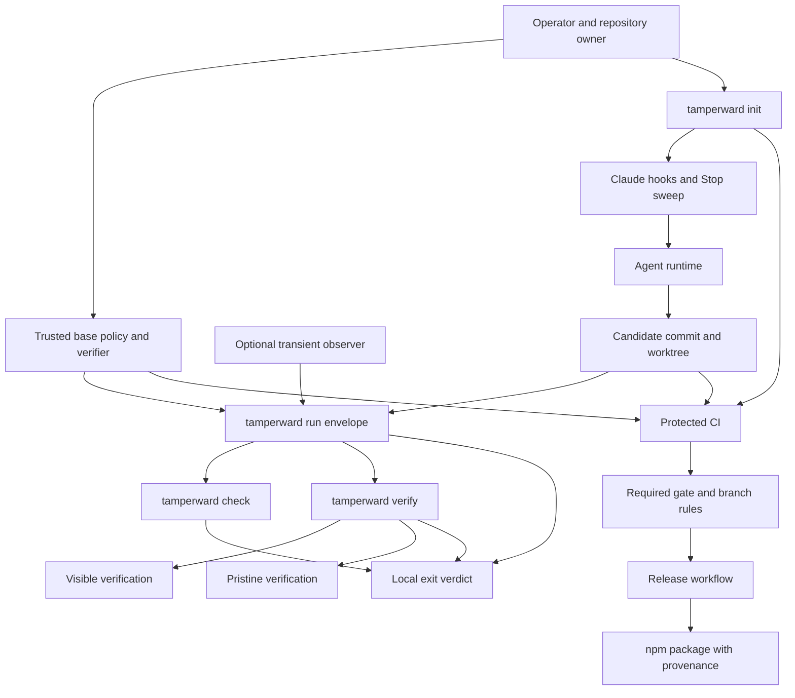

# Tamperward architecture

This page is the component-level map of Tamperward. It complements the lifecycle
diagram in the README: the README focuses on what happens during
`tamperward run`; this diagram shows how the local enforcement surfaces,
trusted base, verification backends, repository authority, and release path fit
together.

## Complete architecture

## Trust boundaries

The central rule is that the candidate may control the working tree, but must
not control the inputs used to judge it.

| Boundary | Trusted input | Candidate-controlled input | Result |
| --- | --- | --- | --- |
| In-loop steering | Installed Tamperward wiring and live protected-state reads | Tool-call payload and working tree | Immediate deny or correction signal |
| Local envelope | Entry commit, base policy, verifier definition, lifecycle supervisor | Agent process, exit code, candidate tree | Independent post-exit adjudication |
| Verification | Base-restored protected files and trusted command definition | Candidate implementation and runtime effects | Visible/pristine outcome |
| Repository authority | Protected workflow and branch rules | Pull request contents and proposed commit | Merge allowed or refused |
| Release | Reviewed main commit and trusted publishing identity | Version metadata within the reviewed commit | Published package or failed release |

## Data flow

1. `init` installs the supported local and repository enforcement surfaces.
2. Hooks provide fast feedback while the agent works; they are not the final
   authority.
3. `run` freezes the entry state and trusted policy, supervises the agent, then
   adjudicates the released tree.
4. `check` evaluates committed and worktree changes. `verify` runs the candidate
   and a base-restored verification copy.
5. Protected CI evaluates the pull request and the required gate controls what
   reaches `main`.
6. The release workflow publishes only the reviewed version from `main`, then
   records it with a tag and GitHub release.

## Compatibility

The diagrams intentionally use conservative Mermaid syntax:

- `graph TD`, which is supported by older Mermaid renderers as well as current
  Mermaid implementations;
- plain node identifiers and quoted labels;
- no nested `subgraph`, HTML labels, class definitions, click handlers, or
  renderer-specific configuration;
- short labels and ordinary ASCII punctuation.

This keeps the diagrams usable in GitHub, the VitePress documentation site,
Markdown previewers, and browser clients that bundle an older Mermaid version.
