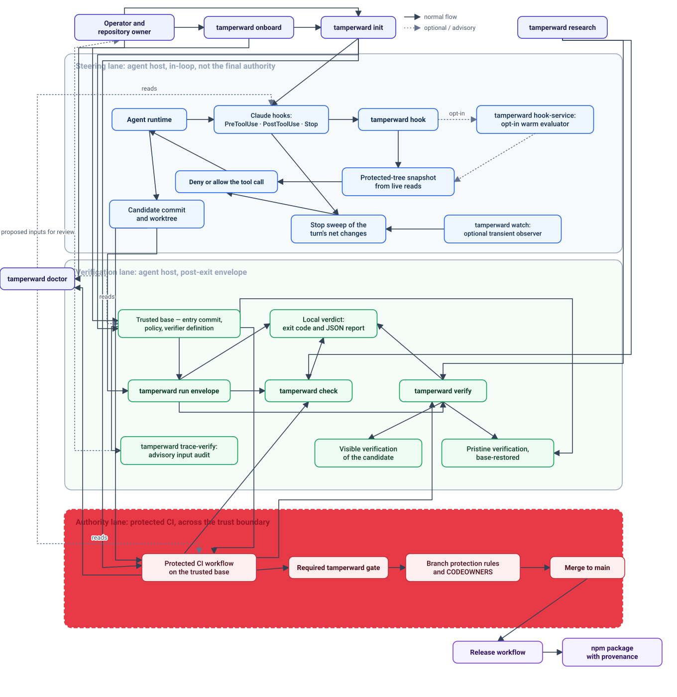

# Tamperward architecture

This page is the component-level map of Tamperward. It complements the lifecycle
diagram in the README: the README focuses on what happens during
`tamperward run`; this diagram shows how the local enforcement surfaces,
trusted base, verification backends, repository authority, and release path fit
together.

## Complete architecture

The diagram is drawn as three lanes. **Steering** and **Verification** run on the
agent's host, where the agent shares the filesystem with everything that judges
it; **Authority** runs in protected CI, on the other side of the trust boundary
(the shaded, dashed lane), and re-runs the same `check` and `verify` against the
trusted base. `init` writes into all three lanes; `doctor` reads all three.
Dotted edges are optional or advisory paths.

The `ci` edges into `check` and `verify` are the authority argument in one
picture: the generated workflow runs `doctor`, `check --diff` and
`verify --require-ancestor` against the pull request's **base** — the same
commands the local envelope ran, but with inputs the candidate could not have
written. The `policy → pristine` edge is why a pristine run is different from a
visible one: the verification surface is restored from the trusted base, not
read from the candidate tree. There is deliberately no `check → pristine` edge;
diff-time detection and re-execution are independent layers.

## Trust boundaries

The central rule is that the candidate may control the working tree, but must
not control the inputs used to judge it.

| Boundary | Trusted input | Candidate-controlled input | Result |
| --- | --- | --- | --- |
| In-loop steering | Installed Tamperward wiring and live protected-state reads | Tool-call payload and working tree | Immediate deny or correction signal |
| Local envelope | Entry commit, base policy, verifier definition, lifecycle supervisor | Agent process, exit code, candidate tree | Independent post-exit adjudication |
| Verification | Base-restored protected files and trusted command definition | Candidate implementation and runtime effects | Visible/pristine outcome |
| Repository authority | Protected workflow and branch rules | Pull request contents and proposed commit | Merge allowed or refused |
| Release | Reviewed main commit and trusted publishing identity | Version metadata within the reviewed commit | Published package or failed release |

## Data flow

1. `init` installs the supported enforcement surfaces in every lane: the Claude
   hook wiring (Steering), the committed `.tamperward.yml` policy and verifier
   definition (Verification), and the protected workflow (Authority). `onboard`
   is the guided first run around `init` and `doctor`.
2. `doctor` reads all three lanes — hook wiring, the trusted base policy and the
   workflow — and reports posture; the generated workflow runs it before
   verification, and it is a report, not a verdict.
3. Hooks provide fast feedback while the agent works: `tamperward hook` reads a
   live protected-tree snapshot and denies or allows each tool call, and the
   Stop hook sweeps the turn's net changes. The opt-in `hook-service` evaluates
   the same payloads from a warm process; `tamperward watch` is an optional
   observer whose only consumer is the Stop sweep. None of this is the final
   authority.
4. `run` freezes the entry state and trusted policy, supervises the agent, then
   adjudicates the released tree with `check` and `verify` and reports a local
   verdict as an exit code and JSON.
5. `check` evaluates committed and worktree changes. `verify` runs the candidate
   as it stands (visible) and a copy whose verification surface is restored from
   the trusted base (pristine). `trace-verify` observes what the verifier reads
   and proposes `verify.inputs` entries for human review; it edits nothing.
   `research` adjudicates both arms of a paired evaluation with the same `check`
   and `verify` primitives.
6. Protected CI runs the same `doctor`, `check --diff` and `verify` against the
   trusted base, and the required gate, branch protection rules and CODEOWNERS
   decide what reaches `main`.
7. The release workflow publishes only the reviewed version from `main`, then
   records it with a tag and GitHub release.

## Compatibility

The diagram on this page is a standalone, dependency-free SVG
(`architecture.svg`) referenced as a Markdown image, rather than a fenced
Mermaid block:

- it renders identically on GitHub, the VitePress documentation site, Markdown
  previewers, and older browser clients, because no Mermaid runtime has to be
  present or on a compatible version to draw it;
- GitHub's Markdown sanitiser strips inline `<svg>`, so the diagram is a linked
  file (``) that GitHub serves as an image, VitePress
  serves as a static asset, and previewers display directly;
- the file is self-contained — a `viewBox` with a generic system-font stack, no
  external fonts, scripts, or references — with a `role="img"`, `<title>`, and
  `<desc>` for accessibility, so it degrades gracefully everywhere;
- the three lanes, every node and edge, the solid-versus-dotted edge meaning,
  and the shaded dashed-red trust boundary around the Authority lane are drawn
  explicitly, so the picture is exactly what ships rather than what a given
  renderer happens to produce.

The lifecycle diagram in the README still uses conservative Mermaid syntax; this
note applies only to this page's architecture diagram.
