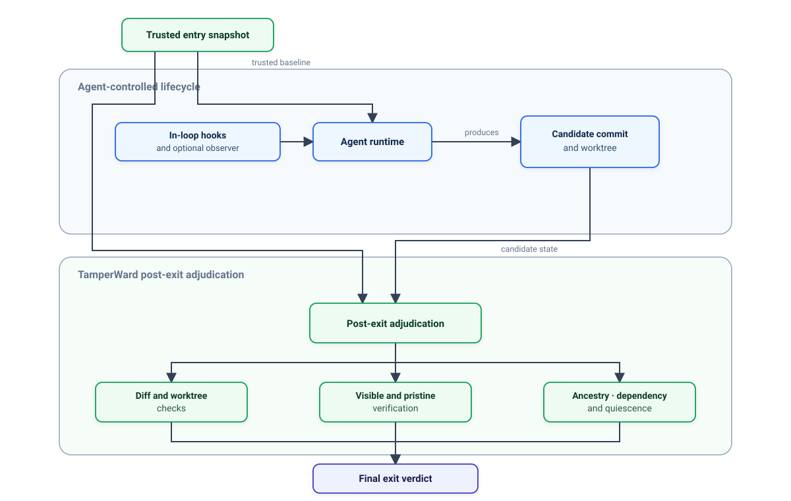

# Integrate

Tamperward is **CLI-first**: there is no code SDK to import. You integrate it by wiring its
commands into the surfaces that already gate your work — the agent's loop, pre-commit, and
CI — and by consuming its [machine output](./reference/machine-output.md) and
[exit codes](./reference/exit-codes.md) from whatever runs those surfaces.

`tamperward init` wires all of this idempotently and non-destructively; this page explains
what it wires and how a program consumes the result, so you can adapt it to a bespoke
pipeline.



[[toc]]

## One command wires it all

```bash
npx tamperward init            # or: npx tamperward onboard  (guided)
npx tamperward init --dry-run  # print the plan without writing
```

`init` writes the policy file and every enforcement point — Claude Code hooks, pre-commit,
CI, CODEOWNERS — and never overwrites files you wrote. The sections below are what to reach
for when a surface needs to be wired by hand or into a non-standard setup. See
[Getting started](./guide/getting-started.md) for the full plan.

## In the agent's loop

In-loop steering (deny-before-execute) ships for **Claude Code** today via two hooks
`init` merges into `.claude/settings.json`:

- **PreToolUse** → `tamperward hook claude` — denies a weakening tool call before it runs.
- **Stop** → `tamperward sweep claude` — re-scans the turn's working tree at end of turn.

Both read the runtime's JSON payload on stdin and emit a deny as JSON on stdout at exit 0.
Other detected runtimes are protected by the agent-neutral layers (pre-commit + CI). The
vendor-neutral steering contract for adding a runtime is on
[Runtime adapters](./guide/runtime-adapters.md).

### Optional: the persistent hook service

For lower per-call latency, run the opt-in [hook service](./guide/enforcement.md#the-persistent-hook-service-opt-in-off-by-default)
— one warm process per user and repository — and set `TAMPERWARD_HOOK_SERVICE=1` in the
runtime's environment. Hooks consult it only under that variable and fall back to
in-process evaluation (the same verdict) when it is absent, stale, or fails its
ownership/mode checks. Not available on Windows.

```bash
tamperward hook-service start --dir .   # foreground; runs until signalled
tamperward hook-service status
```

## At pre-commit

`init` installs a pre-commit hook (husky when present, the plain git hook otherwise) that
runs:

```bash
tamperward check --staged
```

A blocking finding exits 1 and stops the commit; a clean staged diff exits 0. A finding
clears only with a human sign-off recorded by [`tamperward allow`](./reference/cli.md#sign-off-allow).

## In CI — the authority

CI is where the gate is authoritative, because the pull request runs the workflow on its
own head and authority comes from the **repository rules around it**, not from the workflow
copy being trusted. The generated PR-gate workflow runs two steps:

1. `tamperward check --diff <base>...<head>` over the PR range — reading policy from the
   merge-base so a branch cannot govern its own verdict. Cleared only by an out-of-band
   label bound to the head SHA.
2. `tamperward verify --require-ancestor` — pristine re-execution of your suite against the
   base. Its masked-failure verdict clears only by a compact token generated for the exact
   `verify` scope with `tamperward signoff-label --rule verify --head <full-sha>`; the label
   must be regenerated after every push. The verify step **needs a `verify:` block** in `.tamperward.yml` naming the suite
   command; without one it fails closed (exit 2) rather than passing quietly.

Under `GITHUB_ACTIONS=true`, `--format auto` selects the `github` renderer — an inline
annotation per finding plus a job-summary table — so the wiring stays a single line.

Three GitHub-side controls make this authoritative; `init` cannot set them for you, so
configure all three on the protected branch and verify with `doctor`:

```bash
npx tamperward doctor --github --repo owner/repo --branch main
```

1. require the **`tamperward`** status check;
2. enable **Require review from Code Owners**;
3. enable **Dismiss stale pull request approvals when new commits are pushed**.

Until all three are enforced the CI gate is advisory. The trust model behind the two
out-of-band variables (`TAMPERWARD_OOB_SIGNOFF`, `TAMPERWARD_OOB_HEAD`) is on
[Enforcement & sign-off](./guide/enforcement.md); the variables themselves are on
[Environment variables](./guide/environment.md).

## The local enforcement envelope

On Linux, `tamperward run` wraps an agent invocation end to end — recording the trusted
base before the agent starts and re-adjudicating the tree it leaves against that base,
treating the agent's own exit as untrusted:

```bash
tamperward run --base main -- claude -p "fix the failing test"
```

It applies the range check, the worktree check, and pristine verify with policy and
verifier taken from the base. See
[the local enforcement envelope](./architecture.md#the-local-enforcement-envelope).

## Consuming machine output

Any program that drives Tamperward should treat the **exit code as the pass/fail gate** and
parse the [`--json` document](./reference/machine-output.md) for detail. The two agree; the
exit code is the contract even if a document is truncated.

```bash
# Fail the pipeline on a blocking finding or a masked failure; capture detail as JSON.
tamperward check --diff "$BASE...$HEAD" --json > check.json || gate_failed=1
tamperward verify --base "$BASE" --require-ancestor --json > verify.json || gate_failed=1

# Branch on the machine verdict.
verdict=$(jq -r '.verdict' verify.json)
case "$verdict" in
  VERIFIED)        echo "clean" ;;
  MASKED_FAILURE)  echo "visible-green / pristine-red — blocking" ; gate_failed=1 ;;
  CANNOT_VERIFY)   echo "fail-closed: $(jq -r '.reason' verify.json)" ; gate_failed=1 ;;
esac

[ -n "$gate_failed" ] && exit 1 || exit 0
```

Because the JSON major is **additive**, parse defensively and **ignore fields you do not
understand** — new evidence/diagnostic fields ship without a schema bump. Validate against
the [published schemas](./reference/machine-output.md#other-json-surfaces) if you want a
hard contract in your consumer.

## See also

- [CLI reference](./reference/cli.md) — every command and flag.
- [Machine output](./reference/machine-output.md) — the envelopes and enums.
- [Exit codes](./reference/exit-codes.md) — the `0` / `1` / `2` / `124` contract.
- [Runtime adapters](./guide/runtime-adapters.md) — protecting a non-Claude runtime.
- [Architecture](./architecture.md) — how the surfaces fit together.
